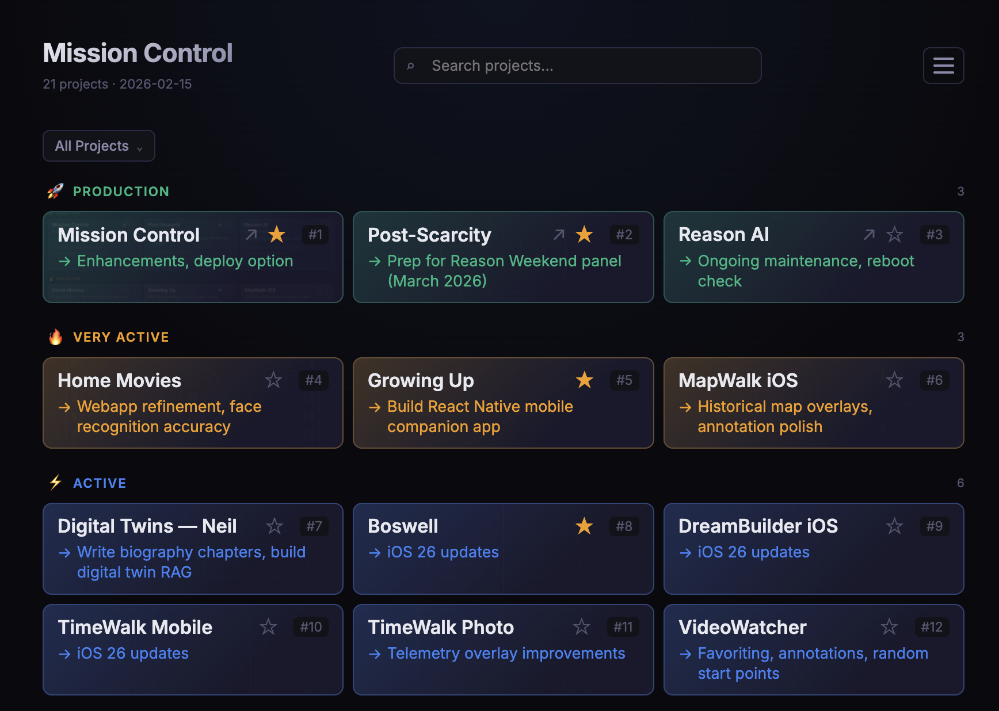

# Mission Control

A project dashboard for managing and launching [Claude Code](https://docs.anthropic.com/en/docs/claude-code) sessions across multiple projects. Built with React 19 and Vite.



## What It Does

Mission Control gives you a single-page overview of all your active projects with:

- **Project cards** organized by category (Production, Very Active, Active, Maintained, Experimental, Life & Ongoing)
- **Per-project to-do lists** that sync to each project's `CLAUDE.md` so Claude picks them up automatically
- **One-click launch** — click a card or its "next steps" to open a dialog with an editable, pre-filled terminal command (`cd <project> && claude`). Command text is auto-focused for quick copy.
- **Starred favorites** — star projects for quick access in a flat, drag-and-drop reorderable view (no category grouping)
- **Compact filter dropdown** — filter by All, Starred, or any category via a popdown menu with checkmarks and project counts
- **Search** — find projects by name, status, tech stack, or to-do items
- **Live site links** — cards with deployed URLs show a clickable external link icon
- **Glassmorphic UI** — tinted card backgrounds per category with adjustable opacity
- **Terminal Colors mode** — toggle in Settings to color each card with its matching terminal background color (from the `proj` shell function)
- **Customizable settings** (hamburger menu):
  - Content scale slider (70%–130%) — scales fonts/icons within cards
  - Card tint opacity slider (0%–40%)
  - Terminal Colors toggle — per-project colors matching terminal background tints
  - Toggle card features: next steps, to-do list, tech tags, status, path
  - Sync Todos to Projects — copies a terminal command that writes all todos into each project's `CLAUDE.md`
  - Reset to defaults
- **Responsive** — works on mobile; search shrinks, hamburger stays top-right, cards go single-column

## How It Works

### Architecture

- **Frontend**: React 19 single-page app (no backend required)
- **Build tool**: Vite — builds to static `dist/` directory
- **Data**: Project info lives in `src/projects.json`; terminal colors are mapped by project name in the `TERMINAL_COLORS` object in `App.jsx`
- **Persistence**: Settings, stars, to-dos, card renames, and starred order are stored in `localStorage`
- **Todo sync**: A Node.js script (`write-todos.cjs`) writes dashboard to-dos into each project's `CLAUDE.md` between managed markers (`<!-- MC-TODOS-START -->` / `<!-- MC-TODOS-END -->`)
- **CSS custom properties**: `--tint-opacity`, `--tint-hover-opacity`, `--content-scale` are set from React state for real-time settings updates

### Key Files

```
src/
  App.jsx          Main React component — all UI logic
  App.css          All styles (glassmorphic cards, dialog, drag-and-drop, responsive, etc.)
  projects.json    Project data (categories, names, paths, tech, todos)
  index.css        Global CSS variables and theme
  main.jsx         React entry point

public/
  images/          Mission Control screenshot

write-todos.cjs    Node.js script to sync todos into project CLAUDE.md files
launch.sh          Build-and-serve script (port 3333)
```

### Todo Sync Flow

1. Edit to-dos directly on any project card in the dashboard
2. Click **Sync Todos to Projects** in the Settings menu (hamburger > Settings)
3. Paste the copied command in your terminal — it writes to-dos into each project's `CLAUDE.md`
4. When you launch Claude in that project folder, it automatically sees the priorities

### Launch Flow

1. Click a project card (or its green "next steps" line)
2. A dialog opens with `cd "<project-path>" && claude` — text is auto-focused and selected
3. Edit the command if needed, then click **Copy & Close** (or press Esc to cancel)
4. Paste into your terminal

## Getting Started

```bash
# Install dependencies
npm install

# Development mode (hot reload)
npm run dev

# Production build + preview
npm start
```

The dashboard runs at [http://localhost:3333](http://localhost:3333).

### Adding Projects

Edit `src/projects.json` to add or modify projects. Each project has:

```json
{
  "id": 1,
  "name": "Project Name",
  "path": "~/path/to/project",
  "tech": ["React", "Node.js"],
  "status": "Description of current state",
  "nextSteps": "What to work on next",
  "url": "https://live-site.example.com",
  "todos": ["Default todo item"]
}
```

To add a matching terminal color, add an entry in the `TERMINAL_COLORS` object in `App.jsx`.

## GitHub

Repository: [tedbarnett/mission-control](https://github.com/tedbarnett/mission-control)

## Built With

Built by **Ted Barnett** and **Claude Code** (Anthropic).

React 19 + Vite | Glassmorphic UI | localStorage persistence | Claude Code integration
